# NightForge Architecture

> Operator workstation stack: Niri compositor + Quickshell UI + Matugen dynamic theming

```mermaid
graph TB
    subgraph "Compositor Layer"
        NIRI["Niri Wayland Compositor"]
        AWWW["awww (wallpaper daemon)"]
        MPD["MPD (music daemon)"]
    end

    subgraph "Quickshell UI Layer"
        SHELL["shell.qml<br/>Entry Point"]
        BAR["Bar.qml<br/>Per-Screen Bar"]
        OVERLAY["Overlay PanelWindow<br/>StackView Widget System"]
        OSD["OSD.qml<br/>On-Screen Display"]

        subgraph "Services"
            MATUGEN["MatugenColors.qml<br/>Dynamic Catppuccin Palette"]
            MPDCLIENT["MpdClient.qml<br/>MPD State + Art"]
            VPN["VpnStatus.qml"]
            PODMAN["PodmanStatus.qml<br/>Container List"]
        end

        subgraph "Widgets (StackView)"
            W_CC["ControlCenterWidget"]
            W_MUSIC["MusicWidget"]
            W_NET["NetworkWidget"]
            W_WALL["WallpaperWidget"]
            W_STATUS["StatusMonitorWidget"]
            W_MON["MonitorWidget"]
        end

        subgraph "Legacy Popups"
            P_CC["ControlCenter.qml"]
            P_MUSIC["MusicPopup.qml"]
            P_NET["NetworkPopup.qml"]
            P_STATUS["StatusMonitor.qml"]
        end

        subgraph "Components"
            GLASS["GlassPanel.qml"]
            BUTTON["BarButton.qml"]
            PILL["StatusPill.qml"]
            SLIDER["VolumeSlider.qml"]
            TOGGLE["ToggleButton.qml"]
            SCALER["Scaler.qml"]
        end
    end

    subgraph "IPC / Script Layer"
        QSM["qs_manager.sh<br/>Widget Toggle Router"]
        IPC["/tmp/qs_widget_state<br/>State File"]

        subgraph "Watchers"
            W_AUDIO["audio_fetch/wait.sh"]
            W_NET["network_fetch/wait.sh"]
            W_BT["bt_fetch/wait.sh"]
            W_BAT["battery_fetch/wait.sh"]
            W_KB["kb_fetch/wait.sh"]
        end

        subgraph "Daemons"
            D_WORK["workspaces.sh<br/>Niri WS JSON"]
            D_MUSIC["music_info.sh<br/>Playerctl + Art Colors"]
        end
    end

    subgraph "Theming Pipeline"
        MATUGEN_BIN["matugen-sync.sh<br/>Image → colors.json"]
        COLORS_JSON["/tmp/matugen/colors.json"]
        QT6CT["qt6ct / kvantum<br/>Qt App Theming"]
    end

    subgraph "Niri Config"
        CONFIG["config.kdl"]
        KEYBINDS["includes/keybinds.kdl"]
        RULES["includes/window-rules.kdl"]
        COMP["includes/compositor.kdl"]
    end

    %% Data Flow
    NIRI -->|"niri msg --json"| D_WORK
    NIRI -->|"spawn-at-startup"| SHELL
    AWWW -->|"wallpaper change"| MATUGEN_BIN
    MATUGEN_BIN --> COLORS_JSON
    COLORS_JSON --> MATUGEN
    MATUGEN --> W_CC
    MATUGEN --> BAR
    MATUGEN --> W_MUSIC

    MPD --> MPDCLIENT
    MPDCLIENT --> BAR
    MPDCLIENT --> W_MUSIC

    D_WORK --> BAR
    W_AUDIO --> BAR
    W_NET --> BAR
    W_BT --> BAR
    W_BAT --> BAR
    W_KB --> BAR

    QSM --> IPC
    IPC --> SHELL
    SHELL --> OVERLAY
    OVERLAY --> W_CC
    OVERLAY --> W_MUSIC
    OVERLAY --> W_NET
    OVERLAY --> W_WALL
    OVERLAY --> W_STATUS
    OVERLAY --> W_MON

    BAR -->|"dispatch()"| QSM

    VPN --> P_CC
    PODMAN --> P_CC

    KEYBINDS -->|"Mod+Shift+S"| QSM
    KEYBINDS -->|"Mod+M"| QSM

    GLASS --> W_CC
    GLASS --> W_MUSIC
    BUTTON --> BAR
    PILL --> BAR
    SLIDER --> P_CC
    TOGGLE --> P_CC

    SCALER --> BAR
    SCALER --> W_MUSIC
```



## System Overview

NightForge is an operator workstation environment built on three pillars:

| Layer | Technology | Purpose |
|-------|-----------|---------|
| **Compositor** | Niri (Wayland) | Window management, tiling, keybinds |
| **Shell / Bar** | Quickshell 0.2.1 | Per-screen bar + widget overlay system |
| **Theming** | Matugen + Catppuccin | Dynamic color extraction from wallpaper |

The shell follows a **single-master-overlay architecture**: one full-screen `PanelWindow` on the `Overlay` layer hosts all popup widgets in a `StackView`, enabling morph transitions between widgets. A separate per-screen `Bar` lives on the `Top` layer.

## Functional Areas

### 1. Quickshell Entry Point (`shell.qml`)

- **Services**: Shared state containers (`MatugenColors`, `MpdClient`, `VpnStatus`, `PodmanStatus`, `SysData`)
- **Bar**: `Variants { model: Quickshell.screens }` → one `PanelWindow` per monitor
- **Overlay**: Single `PanelWindow` with `WlrLayer.Overlay` containing:
  - Dim background (`Rectangle` with `MouseArea` → dismiss on click)
  - `StackView` with animated width/height transitions ("morph" effect)
  - Push/pop transitions: `OutBack` scale + `OutCubic` opacity
- **IPC**: Reads `/tmp/qs_widget_state` via polling + `inotifywait` fallback

### 2. Bar (`modules/Bar.qml`)

Per-screen top bar with:

| Section | Content | Data Source |
|---------|---------|-------------|
| Left | Help, Search, Settings buttons | IPC dispatch |
| Center | Workspace pills with mauve highlight | `niri msg --json workspaces` + jq |
| Center-Right | Inline media (art + title + prev/play/next) | `playerctl` MPRIS |
| Right | Status pills (wifi, bt, vol, bat, kb) | Watcher scripts |
| Far Right | Date | JavaScript `Date` |

**Glass styling**: `base@0.75` background + `text@0.08` border, radius 14px. All buttons have `scale: 1.15` hover with `OutBack` easing.

**Startup cascade**: Each section animates in with staggered `PauseAnimation` delays (50–200ms).

### 3. Widget System (`modules/widgets/`)

All widgets are `Item`-based (not `PanelWindow`) with `implicitWidth/Height` for StackView morphing:

| Widget | Size | Key Features |
|--------|------|-------------|
| `ControlCenterWidget` | 420×600 | Volume/brightness sliders, MPD + MPRIS controls, system toggles (wifi, bt, vpn, dnd, perf), podman container list |
| `MusicWidget` | 680×600 | Large album art, progress bar, prev/play/next, inline header |
| `NetworkWidget` | 380×480 | WiFi/Eth/BT tabs, scan/connect, device list |
| `WallpaperPicker` | 800×500 | Thumbnail grid with `awww` integration, `matugen-sync` on select |
| `StatusMonitorWidget` | 520×600 | **3 tabs**: System (CPU/RAM/disk), Containers (podman list), Sessions (placeholder) |
| `MonitorWidget` | 360×320 | Display output list, resolution grid, refresh slider |

### 4. Services (`services/`)

| Service | Data | Updates |
|---------|------|---------|
| `MatugenColors.qml` | Catppuccin Mocha palette from `/tmp/matugen/colors.json` | File watcher |
| `MpdClient.qml` | Track, artist, album, art URL, elapsed/total, play state | `mpc` polling + `idle` event |
| `VpnStatus.qml` | WireGuard `wg show` connected state | 5s poll |
| `PodmanStatus.qml` | Running container count + names/status | 5s poll |
| `SysData.qml` | CPU/RAM/disk/temp via `/proc/stat`, `/proc/meminfo` | 3s poll |

### 5. Scripts (`scripts/` + `scripts/watchers/`)

**IPC Router** (`qs_manager.sh`):
- Writes widget names to `/tmp/qs_widget_state`
- Handles `close`, `launcher`, `osd:type:label:value`, workspace numbers

**Watcher Pattern** (ilyamiro-style `fetch.sh` + `wait.sh`):
- `audio_fetch.sh`: `wpctl get-volume` → JSON `{volume, mute, source}`
- `network_fetch.sh`: `nmcli` + `wg show` → JSON `{wifi, vpn, eth}`
- `bt_fetch.sh`: `bluetoothctl show` + `devices Connected` → JSON
- `battery_fetch.sh`: `/sys/class/power_supply/BAT*/capacity` → JSON
- `kb_fetch.sh`: `setxkbmap -query` → JSON `{layout}`

**Daemons**:
- `workspaces.sh`: Polls `niri msg --json workspaces` every 500ms, outputs to `/tmp/qs_workspaces.json`
- `music_info.sh`: `playerctl metadata` + ImageMagick color extraction from album art

### 6. Niri Integration (`dotfiles/niri/`)

**Config structure** (modular KDL):

```
config.kdl
├── includes/input.kdl       (keyboard, mouse, touch)
├── includes/keybinds.kdl    (Mod+Shift+S → qs_manager.sh controlcenter)
├── includes/window-rules.kdl (floating rules for popups)
├── includes/compositor.kdl  (rendering, VRR, cursor)
└── includes/local.kdl       (machine-specific overrides)
```

**Autostart**:
- `awww-daemon` (wallpaper)
- `quickshell` (bar + overlay)
- `matugen-sync.sh` (initial color sync)
- `podman-restart.service` (operator containers)
- `mpd.service` (music)

### 7. Theming Pipeline

```
Wallpaper change (awww)
    ↓
matugen-sync.sh [wallpaper_path]
    ↓
ImageMagick extract dominant colors
    ↓
/tmp/matugen/colors.json
    ↓
MatugenColors.qml (file watcher)
    ↓
All QML components re-render with new palette
```

**Palette**: Catppuccin Mocha (base, mantle, crust, surface0-2, overlay0-2, text, subtext0-1, mauve, pink, red, peach, yellow, green, teal, sky, sapphire, blue, lavender)

## Key Execution Flows

### Widget Toggle Flow

```
User presses Mod+Shift+S
    ↓
niri keybinds.kdl → spawn qs_manager.sh controlcenter
    ↓
qs_manager.sh writes "controlcenter" to /tmp/qs_widget_state
    ↓
shell.qml IPC Process reads file (200ms poll + inotifywait)
    ↓
handleIpc("controlcenter")
    ↓
Lookup widgetRegistry → Component: modules/widgets/ControlCenterWidget.qml
    ↓
stackView.push(comp, {mpd: mpdClient, vpn: vpnStatus, podman: podmanStatus})
    ↓
Overlay PanelWindow becomes visible
    ↓
Background dim fades in (200ms OutCubic)
    ↓
Widget scales from 0.92→1.0 + fades in (400ms OutBack)
    ↓
Widget container width/height morph to implicit size (400ms OutQuint)
```

### Workspace Switch Flow

```
User clicks workspace pill #3
    ↓
Bar.qml MouseArea → Process: niri msg action focus-workspace 3
    ↓
Niri switches active workspace
    ↓
workspaces.sh (500ms poll) detects change via niri msg --json workspaces
    ↓
Writes updated JSON to /tmp/qs_workspaces.json
    ↓
Bar.qml wsProc reads JSON, updates win.workspaces array
    ↓
Repeater re-renders pills
    ↓
Active pill: color → mocha.mauve (300ms ColorAnimation)
    ↓
Inactive pills: color → transparent
```

### Media State Flow

```
Player (Firefox/MPD) changes track
    ↓
playerctl emits PropertiesChanged (D-Bus)
    ↓
music_info.sh (2s poll) or MpdClient.qml detects change
    ↓
Fetch: title, artist, album, artUrl, status
    ↓
If artUrl is local file:
    ImageMagick extracts dominant colors → blur + gradient
    ↓
Bar.qml mediaProc updates: mediaTitle, mediaArtist, mediaPlaying, mediaArt
    ↓
Inline media row becomes visible (if mediaTitle !== "")
    ↓
Album art thumbnail + title + prev/play/next buttons render
    ↓
MusicWidget.qml (if open) shows large art + progress bar + EQ visualization
```

## File Structure

```
dotfiles/
├── quickshell/.config/quickshell/
│   ├── shell.qml              # Entry point: Bar + Overlay + IPC
│   ├── main.qml               # Legacy entry (backup)
│   ├── WindowRegistry.js      # Widget layout definitions
│   ├── services/
│   │   ├── MatugenColors.qml  # Dynamic palette from colors.json
│   │   ├── MpdClient.qml      # MPD connection + state
│   │   ├── VpnStatus.qml      # WireGuard status
│   │   ├── PodmanStatus.qml   # Container list
│   │   └── SysData.qml        # CPU/RAM/disk polling
│   ├── modules/
│   │   ├── Bar.qml            # Per-screen top bar
│   │   ├── ControlCenter.qml  # Legacy side panel popup
│   │   ├── MusicPopup.qml     # Legacy music popup
│   │   ├── NetworkPopup.qml   # Legacy network popup
│   │   ├── StatusMonitor.qml  # Legacy status popup
│   │   ├── MonitorPopup.qml   # Legacy monitor popup
│   │   ├── WallpaperPicker.qml # Legacy wallpaper popup
│   │   ├── OSD.qml            # On-screen display overlay
│   │   └── widgets/           # StackView Item-based versions
│   │       ├── ControlCenterWidget.qml
│   │       ├── MusicWidget.qml
│   │       ├── NetworkWidget.qml
│   │       ├── StatusMonitorWidget.qml
│   │       ├── MonitorWidget.qml
│   │       └── WallpaperWidget.qml
│   ├── components/
│   │   ├── GlassPanel.qml     # Glassmorphism background
│   │   ├── BarButton.qml      # Hover-animated button
│   │   ├── StatusPill.qml     # Compact status indicator
│   │   ├── VolumeSlider.qml   # Styled slider
│   │   ├── ToggleButton.qml   # On/off toggle pill
│   │   ├── WorkspaceButton.qml # Workspace pill
│   │   ├── TrayPill.qml       # System tray icon
│   │   └── Scaler.qml         # Responsive scaling utility
│   └── scripts/
│       ├── qs_manager.sh      # IPC router
│       ├── music_info.sh        # MPRIS + art color extraction
│       ├── workspaces.sh        # Niri workspace daemon
│       ├── lock-screen.sh       # gtklock / swaylock launcher
│       └── watchers/
│           ├── audio_fetch.sh, audio_wait.sh
│           ├── network_fetch.sh, network_wait.sh
│           ├── bt_fetch.sh, bt_wait.sh
│           ├── battery_fetch.sh, battery_wait.sh
│           └── kb_fetch.sh, kb_wait.sh
│
├── niri/.config/niri/
│   ├── config.kdl             # Main config + autostart
│   ├── includes/
│   │   ├── input.kdl
│   │   ├── keybinds.kdl
│   │   ├── window-rules.kdl
│   │   ├── compositor.kdl
│   │   └── local.kdl
│   └── scripts/
│       ├── focus-or-spawn.sh
│       ├── screenshot.sh
│       └── keybind-cheatsheet.sh
│
└── gtklock/                     # Lock screen theme
    └── style.css                # Catppuccin Mocha CSS

scripts/
├── apply-dotfiles.sh            # Stow + symlink deploy
├── matugen-sync.sh              # Wallpaper → colors.json
├── toggle-performance-mode.sh   # CPU governor toggle
├── focus-or-spawn.sh            # Window focus/launch helper
├── qs_manager.sh                # Legacy IPC (superseded)
├── qs-network/                  # Network panel logic
│   ├── wifi_panel_logic.sh
│   ├── eth_panel_logic.sh
│   └── bluetooth_panel_logic.sh
├── wallpaper-rotate.sh
├── wallpaper-picker.sh
├── clipboard-picker.sh
└── engagement/                  # Operator workflow
    └── engagement-edit.sh
```

## Dependencies

| Category | Packages |
|----------|----------|
| **Compositor** | `niri`, `awww` |
| **Shell** | `quickshell` (Qt6, QML) |
| **Theming** | `matugen`, `imagemagick`, `qt6ct` |
| **Media** | `mpd`, `mpc`, `playerctl` |
| **Network** | `networkmanager`, `wireguard-tools`, `bluetoothctl` |
| **Audio** | `pipewire`, `wireplumber`, `pamixer` |
| **Containers** | `podman` |
| **Lock** | `gtklock` or `swaylock-effects` |
| **Utils** | `jq`, `inotify-tools`, `socat`, `niri` |

## Known Issues / Migration Notes

1. **ilyamiro port incomplete**: Full ilyamiro widgets (MonitorPopup, MusicPopup with EQ, Network hub-and-bubbles) are copied but not fully adapted from Hyprland → Niri
2. **Hyprland remnants**: Some scripts still reference `hyprctl` (being cleaned)
3. **Preloader disabled**: `incubateObject` not available in Qt 6.11 / Quickshell 0.2.1
4. **Workspace polling**: Niri lacks Hyprland's event socket; uses 500ms polling instead
5. **Two widget systems coexist**: Legacy `PanelWindow` popups + new `Item`-based StackView widgets
